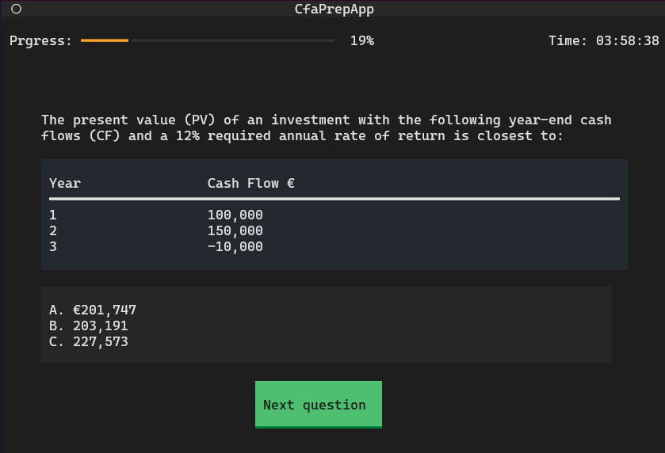

# CFA virtual exam

A simple Chartered Financial Analyst (CFA) mock exams generator.



## Installation

The application use python and an a mongodb database.

```
python3 --version # Verify that python is install
pip install textual
pip install pymongo
```

Create a `.env` file that contains credentials to the mongodb.

```
#.env
MONGODB_PWD=<YOUR_PASSWORD>
MONGODB_USERNAME=<YOUR_USERNAME>
```

Optionally: A question sample can be load to the data base. by executing `python3 backend/model.py` from the root directory.

## References 

[CFA Level 1 exam structure](https://www.cfainstitute.org/en/programs/cfa/exam/level-i)
[CFA curriculum](https://www.cfainstitute.org/programs/cfa/curriculum/study-tips)
